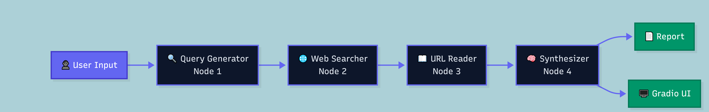

# 🔍 ResearchPilot AI

An autonomous AI research agent that takes any topic, searches the web in real-time, reads 5 sources, and synthesizes a structured report in under 60 seconds.

**Built with:** LangGraph · Tavily Search · Groq (Llama 3.3 70B) · Gradio · HuggingFace Spaces

## Architecture

## How It Works

- Node 1 — LLM generates 3 focused search queries from your topic
- Node 2 — Tavily searches all 3 queries and collects URLs
- Node 3 — Tavily Extract reads full content from top 5 URLs
- Node 4 — LLM synthesizes a structured markdown report

## Quick Start

Install dependencies

    uv install

Add API keys to .env

    GROQ_API_KEY=your_groq_key
    TAVILY_API_KEY=your_tavily_key

Run CLI agent

    uv run python agent.py

Run Gradio UI

    uv run python app.py

Open http://localhost:7860

## Project Structure

    day21/
    ├── agent.py
    ├── app.py
    ├── architecture.png
    ├── requirements.txt
    └── README.md

## Key Features

- Parallel web search via ThreadPoolExecutor
- Source quality filter — skips Reddit, Quora, social media
- Graceful degradation — falls back to snippets if extraction fails
- Auto-saves every report as timestamped .md file
- Input validation and prompt injection detection

## Tech Stack

| Component | Tool |
|---|---|
| Agent Orchestration | LangGraph StateGraph |
| LLM | Groq — Llama 3.3 70B |
| Web Search | Tavily Search API |
| URL Reading | Tavily Extract |
| UI | Gradio |
| Hosting | HuggingFace Spaces |

## Live Demo

https://huggingface.co/spaces/Sameer-khaliq/ResearchPilotAI

---

Day 21 of 80-day AI Specialist Roadmap
